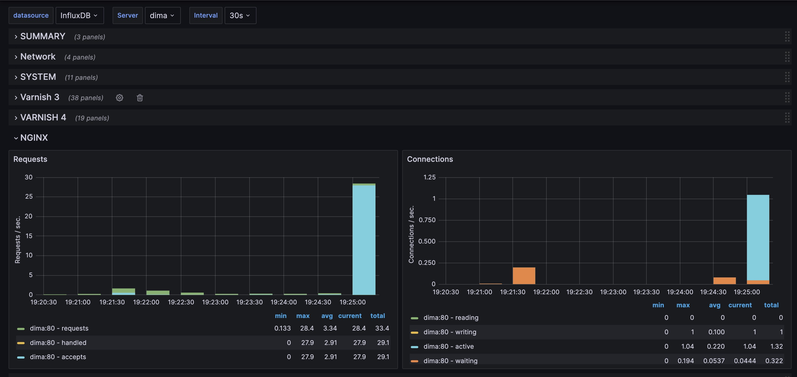
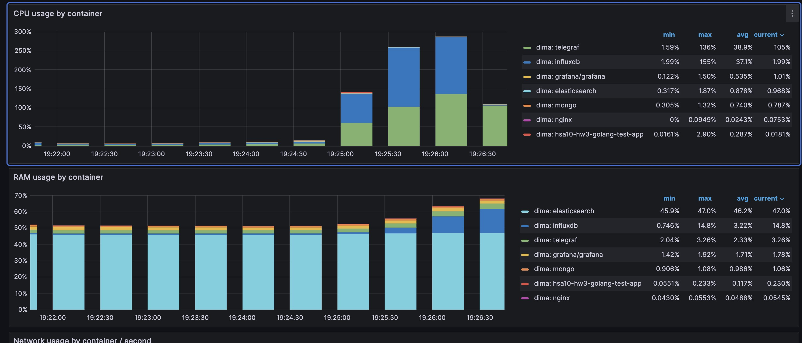
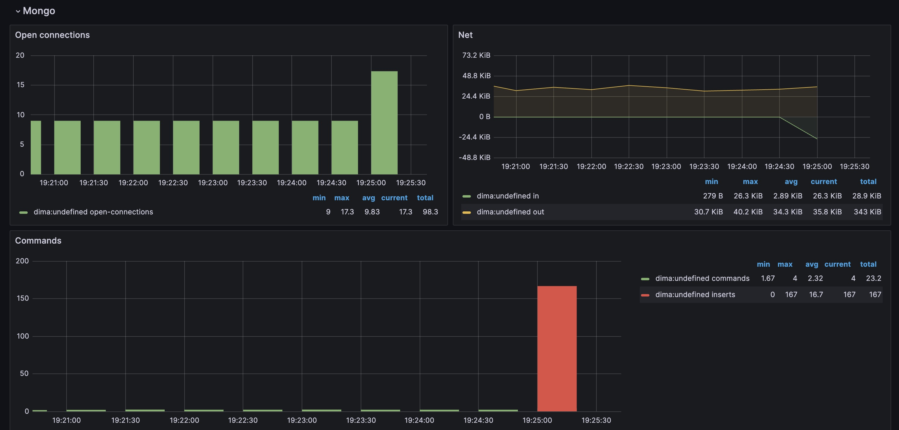
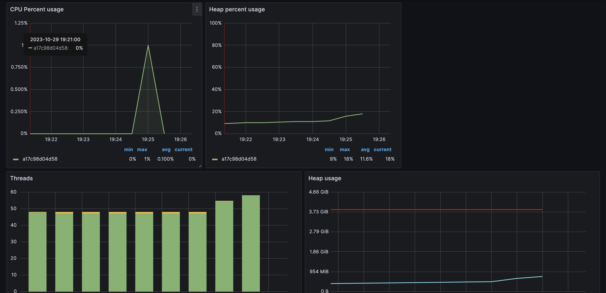

# HSA10  3. Resource monitoring systems 

# Homework 3

# 1. Run services
```
docker-compose up --build -d
```

# 2. Use ab with test.sh script to generate load
```
./test.sh
```

# 3. Check result on grafana using url http://localhost:3000/
# Nginx

# Docker

# Mongo

# ElasticSearch

